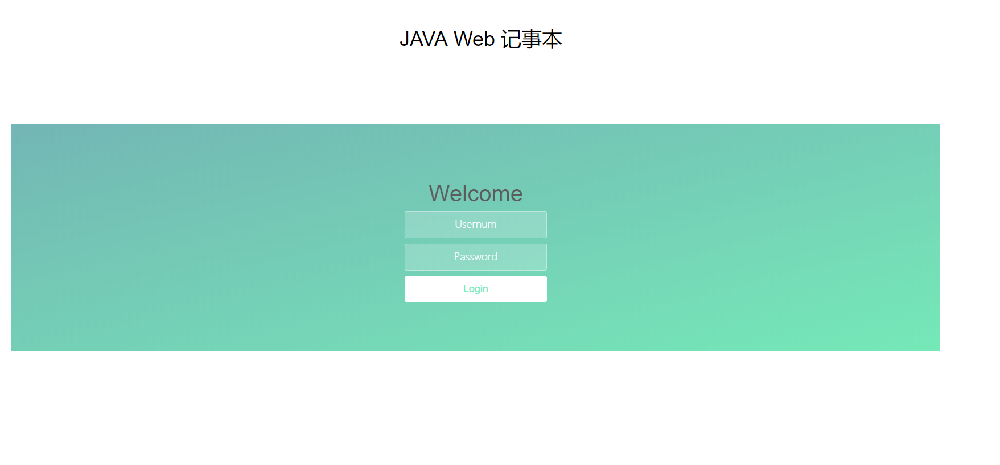
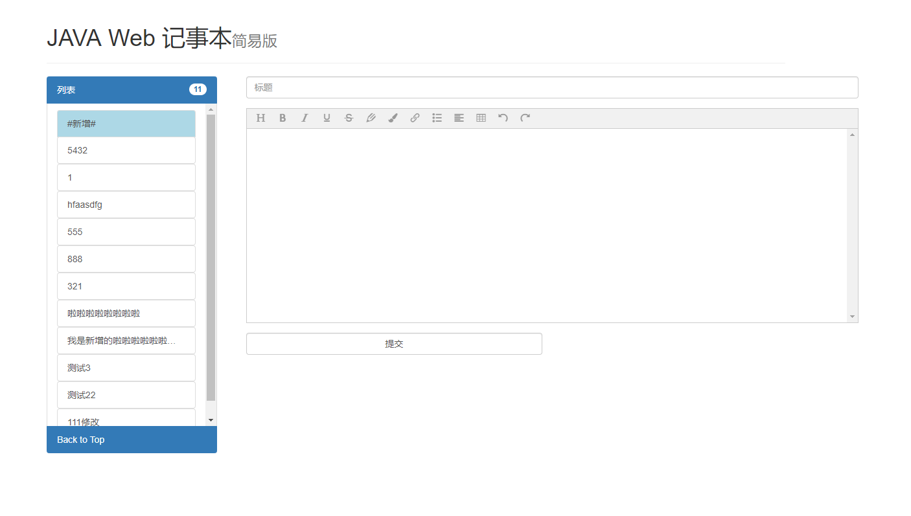

# java-web-notepad
一个微型的java web应用：记事本，在mysql数据库中保存事件记录，实现对事件记录的增删改查，至少包含3个字段：标题、内容、发生时间。

### 项目介绍

#### 开发耗时
    项目开始于2019年12月27号下午创建，初次完成于2019年12月28日下午，耗时经2天，净总耗时不足一天。

#### 具体介绍如下：
    开发一个微型的java web应用：记事本，在mysql数据库中保存事件记录，实现对事件记录的增删改查，至少包含3个字段：标题、内容、发生时间。
    必须先登录。
    项目使用Spring Boot+mybatis+Thymeleaf开发。
    前端使用了jQuery+bootstrap做简单的布局以及动画效果，使用WangEditor作为富文本输入框，暂不提供上传图片的功能
    暂不提供注册功能
    使用sweetalert作为弹窗工具替代原生弹窗。

### 数据库配置
    1、新建一个mysql数据库，执行sql文件夹下面的sql文件，创建表以及导入测试数据。
    2、修改项目数据库配置：
        修改application.properties文件中spring.datasource.url配置为自己数据库
        spring.datasource.url=jdbc:mysql://数据库的IP:端口/数据库名?useUnicode=true&characterEncoding=utf-8&serverTimezone=UTC
        url后半部分的参数保留，或根据实际情况自行修改
        spring.datasource.username = 填写自己的数据库用户名
        spring.datasource.password = 填写自己的数据库用户密码
### 项目配置
    1、请使用idea打开项目，或自行创建java-web-notepad项目后，把所有文件覆盖到目录中。
    2、修改端口号（可跳过）： 同样是application.properties文件，本项目使用端口为server.port=8081，
        自行修改如server.port=80,如果使用80可省略
    3、运行src\main\java\cn\fision\javawebnotepad\JavaWebNotepadApplication类即可启动项目
       访问地址:localhost:8081(对应上面修改的端口号server.port)
    4、使用用户demo，密码123456登录系统
       暂不提供用户注册功能，如需注册，可执行JavaWebNotepadApplicationTests中的addUser测试方法，自行修改用户名和密码

### 截图
  登录页
  

  主页
  
